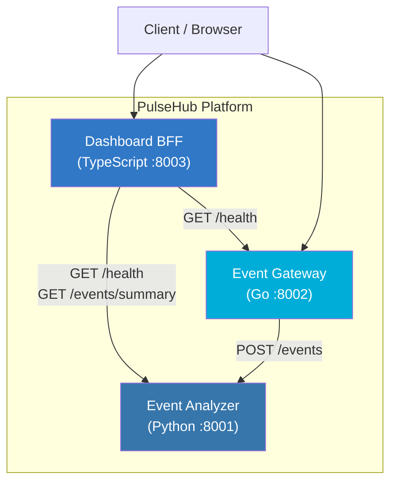

# PulseHub

Real-time event aggregation and analytics platform built with a polyglot microservices architecture.

## Overview

PulseHub collects, processes, and visualizes event data in real time. It is composed of three microservices, each written in a different language, communicating over HTTP REST APIs and orchestrated with Docker Compose.

| Service | Language | Port | Description |
|---------|----------|------|-------------|
| **Analyzer** | Python (FastAPI) | 8001 | Event ingestion, storage, and analysis |
| **Gateway** | Go (net/http) | 8002 | Event collection gateway with validation |
| **Dashboard** | TypeScript (Express) | 8003 | Dashboard BFF with service health aggregation |

## Architecture



## Quick Start

### Prerequisites

- Docker & Docker Compose
- (For local dev) Python 3.12+, Go 1.22+, Node.js 22+

### Using Docker Compose

```bash
# Copy environment config
cp .env.example .env

# Start all services
make up
# or
docker compose up -d --build

# Check health
make health

# Stop
make down
```

### Local Development

```bash
# Run all tests
make test

# Run all linters
make lint
```

## API Specification

### Analyzer Service (Python :8001)

| Method | Endpoint | Description |
|--------|----------|-------------|
| `GET` | `/health` | Health check |
| `POST` | `/events` | Ingest a new event |
| `GET` | `/events/summary` | Get event summary stats |
| `GET` | `/events/analyze` | Get event type analysis |
| `DELETE` | `/events` | Clear all events |

**POST /events** request body:

```json
{
  "event_type": "click",
  "source": "web",
  "payload": { "button": "submit" }
}
```

**GET /events/analyze** response:

```json
[
  { "event_type": "click", "count": 15, "percentage": 60.0 },
  { "event_type": "page_view", "count": 10, "percentage": 40.0 }
]
```

### Gateway Service (Go :8002)

| Method | Endpoint | Description |
|--------|----------|-------------|
| `GET` | `/health` | Health check |
| `POST` | `/events` | Receive and validate events |
| `GET` | `/stats` | Gateway statistics |

**POST /events** request body:

```json
{
  "event_type": "purchase",
  "source": "mobile",
  "payload": { "amount": 29.99 }
}
```

### Dashboard Service (TypeScript :8003)

| Method | Endpoint | Description |
|--------|----------|-------------|
| `GET` | `/health` | Health check |
| `GET` | `/overview` | Aggregated service health overview |
| `GET` | `/services` | List all registered services |

**GET /overview** response:

```json
{
  "services": [
    { "name": "Analyzer", "url": "http://analyzer:8001", "status": "healthy", "responseTimeMs": 12 },
    { "name": "Gateway", "url": "http://gateway:8002", "status": "healthy", "responseTimeMs": 5 }
  ],
  "timestamp": "2026-04-10T12:00:00.000Z"
}
```

## Usage Examples

```bash
# Send an event via Gateway
curl -X POST http://localhost:8002/events \
  -H "Content-Type: application/json" \
  -d '{"event_type": "click", "source": "web", "payload": {"page": "/home"}}'

# Send an event directly to Analyzer
curl -X POST http://localhost:8001/events \
  -H "Content-Type: application/json" \
  -d '{"event_type": "purchase", "source": "api", "payload": {"amount": 49.99}}'

# Get event summary
curl http://localhost:8001/events/summary

# Get event analysis
curl http://localhost:8001/events/analyze

# Check gateway stats
curl http://localhost:8002/stats

# View dashboard overview
curl http://localhost:8003/overview

# List all services
curl http://localhost:8003/services
```

## Project Structure

```
pulsehub/
├── docker-compose.yml
├── Makefile
├── .env.example
├── .gitignore
├── .github/
│   └── workflows/
│       └── ci.yml
├── README.md
└── services/
    ├── analyzer/          # Python (FastAPI)
    │   ├── Dockerfile
    │   ├── requirements.txt
    │   ├── app/
    │   │   ├── __init__.py
    │   │   ├── config.py
    │   │   ├── models.py
    │   │   ├── analyzer.py
    │   │   └── main.py
    │   └── tests/
    │       ├── __init__.py
    │       ├── test_analyzer.py
    │       └── test_api.py
    ├── gateway/           # Go (net/http)
    │   ├── Dockerfile
    │   ├── go.mod
    │   ├── go.sum
    │   ├── main.go
    │   ├── config/
    │   │   └── config.go
    │   ├── handler/
    │   │   ├── handler.go
    │   │   └── handler_test.go
    │   └── models/
    │       └── event.go
    └── dashboard/         # TypeScript (Express)
        ├── Dockerfile
        ├── package.json
        ├── tsconfig.json
        ├── jest.config.js
        ├── .eslintrc.json
        └── src/
            ├── index.ts
            ├── app.ts
            ├── config.ts
            ├── logger.ts
            ├── types.ts
            ├── app.test.ts
            └── logger.test.ts
```

## Environment Variables

See [`.env.example`](.env.example) for all configurable variables.

| Variable | Default | Description |
|----------|---------|-------------|
| `ANALYZER_PORT` | `8001` | Analyzer service port |
| `GATEWAY_PORT` | `8002` | Gateway service port |
| `DASHBOARD_PORT` | `8003` | Dashboard service port |
| `LOG_LEVEL` | `INFO` | Log level (DEBUG, INFO, WARN, ERROR) |
| `ANALYZER_URL` | `http://localhost:8001` | Analyzer service URL |
| `GATEWAY_URL` | `http://localhost:8002` | Gateway service URL |

## CI/CD

GitHub Actions workflow runs on every push and PR to `main`:

1. **test-python** - Lint (flake8) + Test (pytest) the Analyzer service
2. **test-go** - Vet + Test the Gateway service
3. **test-typescript** - Lint (eslint) + Test (jest) + Build the Dashboard service
4. **docker** - Build all Docker images (runs after all tests pass)

> **Note:** The `.github/workflows/ci.yml` file may need to be manually added after the initial repository setup due to API constraints.

## License

MIT
